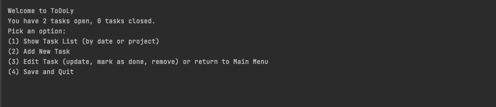
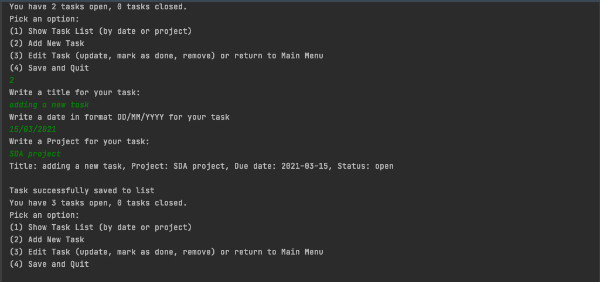

# todoLy
## A command-line todolist - SDA IP 2021

> @Author: Diana Bao

todoLy is a command-line interface that enables user to create, edit and manage task lists for different projects.

Each task has the following fields: title, due date, project and status (open or closed). 

The user can execute several commands by inserting the corresponding command number. Commands include editing the task field(s), deleting a task, sorting tasks per project or due date and saving task list to file. When you quit the program the file containing your tasks and details are saved. This means you can re-open and return to the prior state.

I hope you have fun using todoLy!

#### Class Diagram: 
To access it check the file "classDiagram.uml". To see the dependencies, right-click and select "Show dependencies"

### How to use the program

1. Download the todoLy src code
2. Open the source on an IDE (or Gradle) of your choice that supports Java
3. Navigate to Main.java
4. Run Main.java
5. Interact and use todoLy app on the terminal

### Screenshots of todoLy's functions:

1. Main Menu
   
   

2. Operation of the todoLy app 

   

